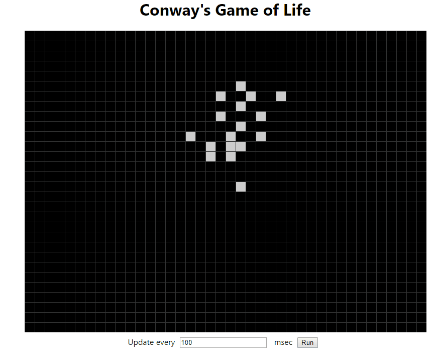

# Game of Life

The Game of Life, also known simply as Life, is a cellular automaton devised by the British mathematician John Horton Conway in 1970.

## Useful links

1. https://en.wikipedia.org/wiki/Cellular_automaton
2. https://en.wikipedia.org/wiki/Conway%27s_Game_of_Life
3. https://medium.freecodecamp.org/create-gameoflife-with-react-in-one-hour-8e686a410174